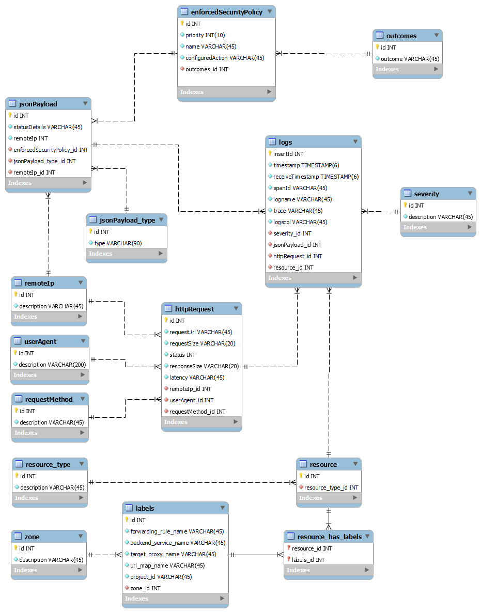

###### Bases de Datos II, Profesor Nereo Campos
###### Prueba Corta # 7-8, Valeria Sell Sáenz
###### Entrega: Miércoles 02 de Noviembre, II Semestre 2022

----

1. Realice un modelo entidad relación normalizado hasta mínimo BCNF (Forma Normal
de Boyce-Codd) de la siguiente información de logs almacenada por un
balanceador de carga en la plataforma GCP. 

Los siguiente fields son únicos a cada entrada de log:
- insertId
- requestSize
- responseSize
- latency
- timestamp
- receivedTimestam

Los siguientes fields, pueden tener valores múltiples
- labels
Se recomienda utilizar MySQL Workbench o Microsoft Visio para implementar el diagrama.

